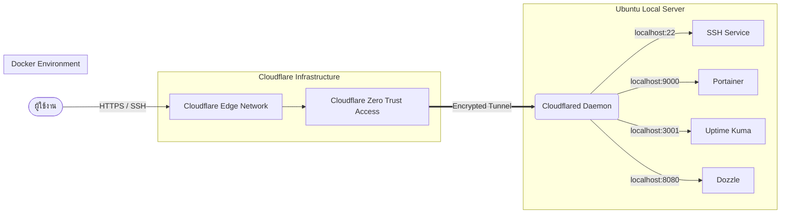

# สถาปัตยกรรมระบบและคู่มือการใช้งาน (System Architecture & Operations Guide)

เอกสารฉบับนี้รวบรวมองค์ความรู้ สถาปัตยกรรมการออกแบบระบบ และคู่มือการดูแลรักษาระบบ (Ubuntu Server + Docker + Cloudflare Tunnel) เพื่อให้ผู้ดูแลระบบสามารถเข้าใจโครงสร้างและสามารถจัดการระบบได้อย่างมีประสิทธิภาพ

---

## 1. ภาพรวมของระบบ (System Overview)

ระบบนี้ถูกออกแบบมาเพื่อให้บริการ Web Applications และบริการพื้นฐานสำหรับนักพัฒนา (เช่น การจัดการ Container, ระบบ Monitoring, ระบบดู Log) โดย **ไม่จำเป็นต้องใช้ Public IP** และ **ไม่ต้องทำ Port Forwarding ที่ Router** 

ระบบใช้เทคโนโลยี **Cloudflare Tunnel (Zero Trust)** เพื่อต่อท่อเข้ารหัสจากเซิร์ฟเวอร์ภายในออกสู่ระบบเครือข่ายระดับโลกของ Cloudflare ซึ่งทำให้:
1. การเข้าถึงระบบมีความปลอดภัยสูง (ซ่อน IP จริงของฝั่งเซิร์ฟเวอร์)
2. ป้องกันการโจมตีประเภท DDoS ได้ทันที
3. สามารถกำหนดสิทธิการเข้าถึงด้วย Cloudflare Access (Zero Trust Access Policies)

---

## 2. สถาปัตยกรรม (Architecture Diagram)



**เส้นทางการไหลของข้อมูล (Traffic Flow):**
1. ผู้ใช้งานเรียกเข้าโดเมน (เช่น `portainer.example.com` หรือ SSH ไปที่ `ssh.example.com`)
2. Request วิ่งไปที่ DNS ของ Cloudflare จากนั้นผ่านด่าน **Cloudflare Zero Trust** (ถ้ามีการตั้ง Policy ไว้ เช่น เช็คอีเมลเข้าสู่ระบบ)
3. ทราฟฟิกจะถูกส่งผ่าน Private Tunnel มายังโปรแกรม `cloudflared` ที่รันเป็น Service อยู่บนเครื่องเซิร์ฟเวอร์
4. `cloudflared` ทำหน้าที่เป็นตัวกระจาย Request (Reverse Proxy) ไปยังพอร์ตต่างๆ ในเครื่อง (`localhost:*`) ที่รันด้วย Docker

---

## 3. บริการพื้นฐานภายในระบบ (Core Services)

บริการทั้งหมดแยกทำงานอยู่บน **Docker Containers** เพื่อความง่ายในการจัดการและป้องกันการรบกวนกัน (Isolation)

| ชื่อบริการ | พอร์ตบนเครื่อง | หน้าที่หลัก |
| :--- | :--- | :--- |
| **SSH** | 22 (Native) | โปรโตคอลจัดการเซิร์ฟเวอร์ผ่าน Command Line |
| **Portainer CE** | 9000 | Web UI สำหรับใช้จัดการ Docker Container / Image / Network อย่างง่าย |
| **Uptime Kuma** | 3001 | ระบบ Monitor สำหรับเช็คสถานะว่า Container หรือเว็บต่างๆ ยังทำงานอยู่หรือไม่ (สามารถส่งแจ้งเตือนผ่าน Line/Discord ได้) |
| **Dozzle** | 8080 | Web UI สำหรับดู Logs ของทุกๆ Docker Container แบบ Real-time ที่เบาและเร็ว |

*(หมายเหตุ: ทุกบริการถูก Map พอร์ตผูกไว้กับ `127.0.0.1` เท่านั้น เครือข่ายภายนอกหรือวง LAN ภายในจะไม่สามารถเข้าตรงๆ ผ่าน IP เครื่องได้ ต้องเข้าผ่านโดเมน Cloudflare เท่านั้นตามคอนเซปต์ Zero Trust)*

---

## 4. โครงสร้างไฟล์และสคริปต์ (Scripts & Automation)

โปรเจกต์นี้มีสคริปต์ที่คอยช่วยเหลือในการติดตั้ง (Automation Scripts) ซึ่งช่วยลดขั้นตอนที่ซับซ้อน:

- **`setup.sh`** 
  สคริปต์เริ่มต้นสำหรับเตรียมความพร้อม Ubuntu ติดตั้งเครื่องมือพื้นฐาน และติดตั้ง Docker + Docker Compose
- **`setup-cloudflare.sh`**
  ใช้ติดตั้ง `cloudflared` ทำการผูกบัญชีเข้ากับ Cloudflare, สร้าง Tunnel ใหม่ และเพิ่มกฎการเข้าถึง `SSH` เป็นอย่างแรก
- **`add-web-services.sh`**
  ใช้สำหรับอ่านไฟล์ `docker-compose.yml` ลงในระบบ, รัน Container ขึ้นมา, อัปเดตไฟล์ `/etc/cloudflared/config.yml` เพื่อชี้โดเมน เช่น `portainer`, `status`, `logs` มายัง `localhost` พร้อมทั้งอัปเดต DNS CNAME บน Cloudflare ให้อัตโนมัติ
- **`add-service.sh`**
  สคริปต์รายย่อยสำหรับ "นักพัฒนา" ที่ต้องการขึ้นโปรเจกต์ใหม่ (เช่น เปิดเว็บแอปของตัวเองรันบนพอร์ต 3000) สามารถรันสคริปต์นี้เพื่อเพิ่มโดเมนและรับทราฟฟิกเข้าพอร์ตที่ต้องการได้ทันทีโดยไม่ต้องแก้ Config เองด้วยมือ
- **`docker-compose.yml`**
  ไฟล์หัวใจหลักสำหรับการตั้งค่า Docker มีการประกาศ Image, Volumes และการผูก Port สำหรับบริการพื้นฐาน

---

## 5. คู่มือการใช้งาน (Usage Guide)

### 5.1 การแก้ไข หรือลบ Service ออกจาก Tunnel
1. ใช้ Command Line เปิดแก้ไขไฟล์คอนฟิกหลักด้วยสิทธิ์ root:
   ```bash
   sudo nano /etc/cloudflared/config.yml
   ```
2. โครงสร้างจะเป็น YAML ให้ทำการระมัดระวังการใช้ Space (ห้ามใช้ Tab)
3. เมื่อแก้ไขเสร็จ ทำการบันทึก (Ctrl+O, Enter, Ctrl+X) จากนั้นโหลดค่าใหม่:
   ```bash
   sudo systemctl restart cloudflared
   ```

### 5.2 การจัดการ Docker
- สั่งปิด Service เริ่มต้นทั้งหมด: `docker compose down`
- สั่งเปิด Service ทั้งหมดเป็น Background: `docker compose up -d`
- อัปเดตระบบให้เป็นเวอร์ชันล่าสุด: `docker compose pull && docker compose up -d`

### 5.3 การเชื่อมต่อ SSH
ไคลเอนต์ (เครื่องลูก) จะต้องติดตั้ง `cloudflared` แจ้งตั้งค่าใน `~/.ssh/config` ดังนี้:
```text
Host ssh.yourdomain.com
    ProxyCommand cloudflared access ssh --hostname %h
```
จากนั้นพิมพ์ `ssh user@ssh.yourdomain.com` ได้เลย

---

## 6. แนวทางปฏิบัติด้านความปลอดภัย (Security Best Practices)

- **ห้ามเปิด Port แบบ Public** บน Virtual Cloud หรือ Router โดยเด็ดขาด 
- **จัดการหน้ากากผ่าน Zero Trust**: บริการที่เปิดไว้ผ่าน `add-web-services.sh` เช่น Portainer เป็นหน้าต่างบริหารเซิร์ฟเวอร์ **ต้อง** เข้าไปที่แผนควบคุมของ Cloudflare (Zero Trust > Access > Applications) และสร้าง Policy ดักไว้เสมอ เพื่อให้เฉพาะ Email ที่ระบุเท่านั้นมีสิทธิ์มองเห็นหน้าเว็บนี้ ป้องกันผู้ไม่หวังดีสุ่มพาสเวิร์ด (Brute Force)
- รหัสผ่าน Admin ของฝั่ง Portainer และ Uptime Kuma ควรใช้รหัสที่แข็งแรง ประกอบไปด้วยตัวอักษรและสัญลักษณ์

---

## 7. ปัญหาที่พบบ่อย (Troubleshooting Tips)

**ปัญหา: เข้า Portainer ครั้งแรกแล้วขึ้นหน้าขาว / HTTP Error 404**
- **สาเหตุ:** Portainer มีระบบรักษาความปลอดภัย หากเพิ่งสร้างคอนเทนเนอร์แล้วไม่มีการตั้งค่า Admin ภายในเวลา 5 นาที โปรแกรมจะระงับการเข้าถึงและ Redirect ไปยังหน้า `timeout.html` ซึ่งท่อ Cloudflare จะอ่านและมองไม่เห็นปลายทางที่ถูกต้องนั้น
- **วิธีแก้:** ไปที่ Terminal แล้วรันคำสั่งบังคับรีสตาร์ทคอนเทนเนอร์ แล้วให้ **รีบเข้าหน้าเว็บภายใน 5 นาที** 
  ```bash
  docker restart portainer
  ```

**ปัญหา: รันคำสั่ง `cloudflared tunnel list` แล้วติด Error "Cannot determine default origin certificate path"**
- **สาเหตุ:** ขาดดึงไฟล์ใบรับรอง (`cert.pem`) เนื่องจากการสลับผู้ใช้ หรือไฟล์ cert อยู่ที่ User account อื่น (เช่น root)
- **วิธีแก้:** ทำการรันคำสั่งยืนยันตัวตนซ้ำอีกครั้งในโหมดผู้ใช้ปัจจุบัน
  ```bash
  cloudflared tunnel login
  ```

**ปัญหา: เพิ่ม Service แล้วเข้าเว็บไม่ได้**
1. เช็คว่า Container รันติดไหม: `docker ps`
2. เช็คว่าผูก Port ไป `127.0.0.1` เปล่า (ต้องผูกด้วย 127.0.0.1 เท่านั้นเพื่อความปลอดภัย)
3. ตรวจสอบว่าใน `/etc/cloudflared/config.yml` ชี้ถูกที่หรือไม่
4. รีสตาร์ทท่อ: `sudo systemctl restart cloudflared`